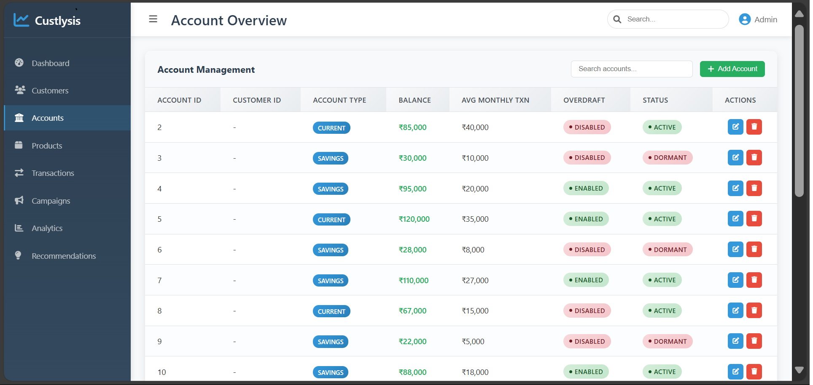
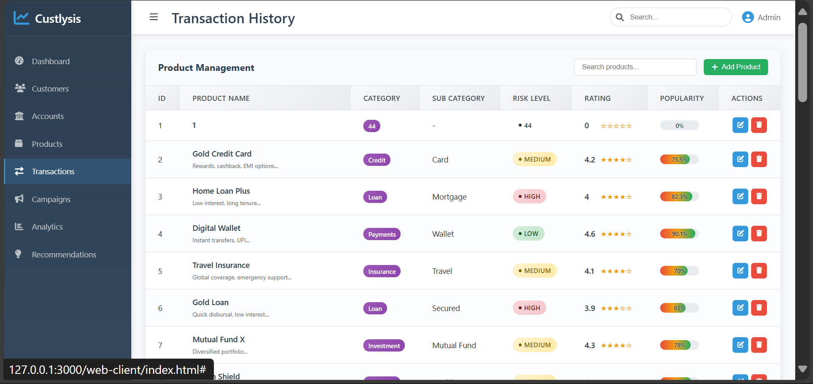

# Custlysis - Customer Analysis System for Banking

A comprehensive **Customer Analysis and Management System** designed specifically for banking institutions to analyze customer behavior, manage accounts, and optimize banking operations through data-driven insights.

##  Overview

Custlysis is a full-stack banking analytics platform that provides banks with powerful tools to understand their customers, manage accounts efficiently, and make informed business decisions. The system combines customer demographics, account management, transaction analysis, and product recommendations in a unified dashboard.

##  Key Features

###  **Customer Analytics Dashboard**
- Real-time customer demographics and behavior analysis
- Digital score tracking and risk profiling
- Churn risk assessment and customer segmentation
- Geographic clustering and location-based insights

###  **Account Management**
- Multi-account support (Checking, Savings, Investment)
- Balance tracking with Indian Rupee (₹) currency support
- Overdraft management and dormancy monitoring
- Channel preference analysis (Online, Mobile, ATM, Branch)

###  **Transaction Management**
- Comprehensive transaction history and analysis
- Real-time transaction monitoring
- Merchant category tracking
- High-value and recurring transaction identification

###  **Product Management**
- Banking product catalog management
- Risk-based product categorization
- Eligibility rules and rating system
- Popularity scoring and recommendations

### 🔧 **CRUD Operations**
- Complete Create, Read, Update, Delete functionality
- Real-time data synchronization
- Form validation and error handling
- Responsive user interface

## 🛠️ Technology Stack

### **Backend**
- **Framework**: Spring Boot 3.x
- **Language**: Java 17
- **Database**: MySQL 8.0
- **ORM**: JPA/Hibernate
- **Build Tool**: Maven
- **Architecture**: RESTful API

### **Frontend**
- **Languages**: HTML5, CSS3, JavaScript (ES6+)
- **Styling**: Custom CSS with responsive design
- **Charts**: Chart.js for data visualization
- **Icons**: Font Awesome
- **Architecture**: Single Page Application (SPA)

### **Database**
- **Type**: Relational Database (MySQL)
- **Tables**: Customer, Account, Product, Transactions, and more
- **Features**: Auto-generated schemas, foreign key relationships
- **Data**: Pre-populated with realistic Indian banking data

##  Quick Start

### Prerequisites
- Java 17 or higher
- Maven 3.6+
- MySQL 8.0
- Modern web browser

### Installation

1. **Clone the repository**
   ```bash
   git clone https://github.com/Pulkitjakhmola/custlysis.git
   cd custlysis
   ```

2. **Setup Database**
   ```bash
   # Create MySQL database
   mysql -u root -p
   CREATE DATABASE bank_system;
   
   # Import sample data
   mysql -u root -p bank_system < database/custlysis_data_insert.sql
   ```

3. **Configure Application**
   ```properties
   # Update Custlysis/src/main/resources/application.properties
   spring.datasource.url=jdbc:mysql://localhost:3306/bank_system
   spring.datasource.username=your_username
   spring.datasource.password=your_password
   ```

4. **Run Backend**
   ```bash
   cd Custlysis
   mvn clean compile
   mvn spring-boot:run
   ```

5. **Launch Frontend**
   ```bash
   # Open web-client/index.html in your browser
   # Or serve via local web server
   ```

##  Project Structure

```
custlysis/
├── Custlysis/                          # Spring Boot Backend
│   ├── src/main/java/com/pblGEHU/Custlysis/
│   │   ├── controller/                 # REST API Controllers
│   │   ├── entity/                     # JPA Entities
│   │   ├── repository/                 # Data Access Layer
│   │   └── CustlysisApplication.java   # Main Application
│   ├── src/main/resources/
│   │   └── application.properties      # Configuration
│   └── pom.xml                         # Maven Dependencies
├── web-client/                         # Frontend Application
│   ├── index.html                      # Main HTML File
│   ├── script.js                       # JavaScript Logic
│   └── style.css                       # Styling
├── database/                           # Database Scripts
│   ├── custlysis_data_insert.sql       # Sample Data
│   └── import-database.bat             # Import Script
└── README.md
```

##  API Endpoints

### Customer Management
- `GET /api/customers` - Get all customers
- `POST /api/customers` - Create new customer
- `PUT /api/customers/{id}` - Update customer
- `DELETE /api/customers/{id}` - Delete customer

### Account Management
- `GET /api/accounts` - Get all accounts
- `POST /api/accounts` - Create new account
- `PUT /api/accounts/{id}` - Update account
- `DELETE /api/accounts/{id}` - Delete account

### Product Management
- `GET /api/products` - Get all products
- `POST /api/products` - Create new product
- `PUT /api/products/{id}` - Update product
- `DELETE /api/products/{id}` - Delete product

### Transaction Management
- `GET /api/transactions` - Get all transactions
- `POST /api/transactions` - Create new transaction

##  Key Features in Detail

### Customer Analytics
- **Digital Score**: Measures customer's digital engagement (0-100)
- **Risk Profiling**: Low, Medium, High risk categorization
- **Churn Prediction**: ML-ready churn risk scoring
- **Geographic Segmentation**: Urban, Semi-urban, Rural clustering

### Account Features
- **Multi-Currency Support**: Indian Rupee (₹) formatting
- **Account Types**: Checking, Savings, Investment, Business
- **Status Tracking**: Active, Dormant, Overdraft status
- **Channel Analytics**: Preferred banking channels

### Transaction Intelligence
- **Real-time Processing**: Live transaction monitoring
- **Category Analysis**: Merchant category insights
- **Pattern Recognition**: Recurring and high-value detection
- **Geographic Tracking**: Location-based transaction analysis

##  Security Features

- Input validation and sanitization
- SQL injection prevention via JPA
- CORS configuration for secure API access
- Error handling and logging

##  Sample Data

The system comes pre-loaded with:
- **50+ Customer Records** with realistic Indian demographics
- **Multiple Account Types** per customer
- **Banking Products** including savings, checking, investments
- **Transaction History** with various patterns and categories
- **Geographic Distribution** across Indian cities

## 🖥️ Screenshots

### Dashboard Overview


### Customer Management


### Account Management


### Transaction History


##  Getting Started Guide

### Step 1: Environment Setup
1. Install Java 17+ and Maven
2. Install MySQL 8.0
3. Clone the repository

### Step 2: Database Configuration
1. Create database: `CREATE DATABASE bank_system;`
2. Update `application.properties` with your MySQL credentials
3. Run the import script: `mysql -u root -p bank_system < database/custlysis_data_insert.sql`

### Step 3: Backend Startup
```bash
cd Custlysis
mvn clean install
mvn spring-boot:run
```

### Step 4: Frontend Access
1. Open `web-client/index.html` in your browser
2. The application will connect to `http://localhost:9090`

##  Configuration

### Database Configuration
```properties
# application.properties
spring.datasource.url=jdbc:mysql://localhost:3306/bank_system
spring.datasource.username=root
spring.datasource.password=root
spring.jpa.hibernate.ddl-auto=update
```

### Frontend Configuration
```javascript
// script.js
const API_BASE_URL = 'http://localhost:9090/api';
```

##  Performance Features

- **Lazy Loading**: Efficient data loading for large datasets
- **Pagination**: Built-in pagination for customer and transaction lists
- **Caching**: JPA second-level caching for improved performance
- **Indexing**: Database indexes on frequently queried fields

##  Testing

### Backend Testing
```bash
cd Custlysis
mvn test
```

### API Testing
Use the included test file `web-client/test.html` to test API endpoints:
- Connection testing
- CRUD operations testing
- Data validation testing

##  Troubleshooting

### Common Issues

1. **Database Connection Failed**
   - Check MySQL service is running
   - Verify credentials in `application.properties`
   - Ensure database `bank_system` exists

2. **Port 9090 Already in Use**
   - Change port in `application.properties`: `server.port=8080`
   - Update frontend API URL accordingly

3. **Frontend Not Loading Data**
   - Verify backend is running on correct port
   - Check browser console for CORS errors
   - Ensure API endpoints are accessible

##  Contributing

1. Fork the repository
2. Create a feature branch (`git checkout -b feature/AmazingFeature`)
3. Commit your changes (`git commit -m 'Add some AmazingFeature'`)
4. Push to the branch (`git push origin feature/AmazingFeature`)
5. Open a Pull Request

### Development Guidelines
- Follow Java coding standards
- Write meaningful commit messages
- Add comments for complex logic
- Test your changes thoroughly

##  License

This project is licensed under the MIT License - see the [LICENSE](LICENSE) file for details.

##  Authors

- **Development Team** - *Initial work* - <br>
[Pulkit Jakhmola (github profile)](https://github.com/Pulkitjakhmola)  <br>
[Rahul Kandwal (github profile)](https://github.com/rahulkandwal19)   <br>
[Rachit Bangwal (github profile)](https://github.com/rachitbangwal)

##  Acknowledgments

- Built for banking industry customer analysis needs
- Designed with Indian banking context and currency
- Responsive design for modern banking operations
- RESTful API architecture for scalability
- Spring Boot community for excellent framework
- MySQL for reliable database management

##  Support

For support and questions:
- Create an issue in this repository
- Email: jakhmolapulkit4@gmail.com
- Documentation: [Wiki](https://github.com/PulkitJakhmola/custlysis/wiki)

## 🔮 Future Enhancements

- [ ] Machine Learning integration for predictive analytics
- [ ] Real-time notifications and alerts
- [ ] Advanced reporting and export features
- [ ] Mobile application development
- [ ] Integration with external banking APIs
- [ ] Enhanced security with JWT authentication
- [ ] Docker containerization
- [ ] Cloud deployment support


**🔗  | 📖 [Documentation](https://github.com/Pulkitjakhmola/custlysis/wiki) | 🐛 [Report Bug](https://github.com/Pulkitjakhmola/custlysis/issues)**
